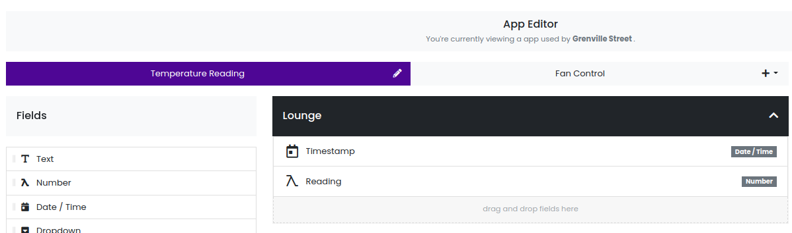

### Datanest Public API Node.js Wrapper

This is a simple Node.js wrapper of the public Datanest REST API.

#### Requirements

- `node.js`
- `npm` (recommended)
- [Datanest](https://datanest.earth) account
- [Datanest](https://datanest.earth) API key (request from [hello@datanest.earth](mailto:hello@datanest.earth))
- Create a Datanest project, you will need the project id

#### Authentication

You must provide an API key using either of these two methods:

1. Create a .env file with `DATANEST_API_KEY={your key here}`
2. Call `datanestApi.setApiKey('your key here');`

#### Installation

Install into your project
`npm install --save npm install --save git+https://github.com/brandondr/datanest-api.git`

Or copy `./datanest-api.js` file
`npm install --save axios moment`

#### Example usage

For example, let's say you wish to push temperature readings to a Gather App.

Here is an example app



This code pushes up temperature 'Readings' (random numbers for example purposes)

```js
// If you have a .env file
// (you may need to run 'npm install --save dotenv')
require("dotenv").config();

const DatanestApi = require("datanest-api");
// Optionally include the key parameter. If you do not use a .env file
const datanestApi = new DatanestApi("(your key here)");

// You can override the key later during runtime
datanestApi.setApiKey("(your key here)");

(async () => {
  let { items } = await datanestApi.createGatherItems(
    8176, // Project id
    "Temperature Reading",
    [
      {
        title: "New Item 1",
        Lounge: {
          Timestamp: datanestApi.getTimestamp(),
          Reading: Math.round(Math.random() * 30),
        },
      },
      {
        title: "New Item 2",
        Lounge: {
          Timestamp: datanestApi.getTimestamp(),
          Reading: Math.round(Math.random() * 30),
        },
      },
    ]
  );
})();
```

#### Methods

Get with pagination (15 items per page)
`await getGatherItems(int projectId, string appName, bool latestItems=true) : object`

Create one or many items
`await createGatherItems(int projectId, string appName, array items) : object`

Update one or many items by their Title
`await updateGatherItems(int projectId, string appName, array items) : object`

Delete one or many items by their Title
`await deleteGatherItems(int projectId, appName, array itemTitles, bool allowMultiple=false) : object`
